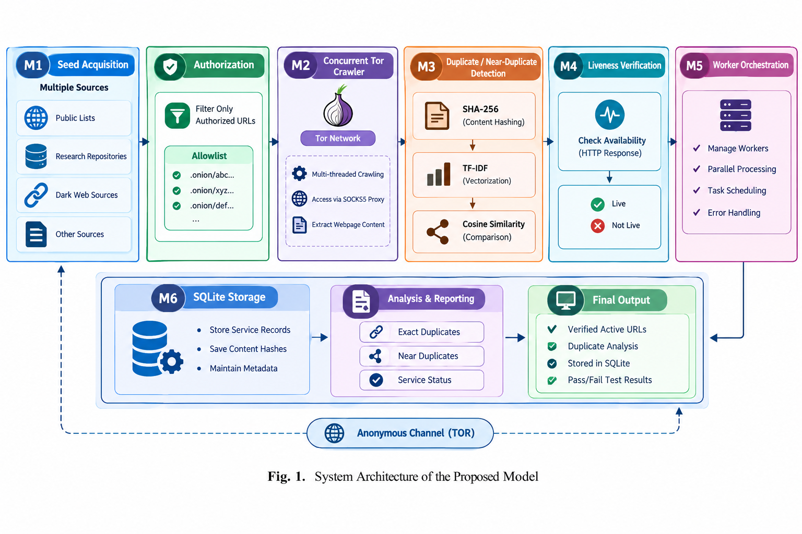

Efficient Enumeration of URLs of Active Hidden Servers over Anonymous Channel (TOR)
Project Code: PRJ_164
Project ID: RJ_164
Domain: Cybersecurity / Network Security / Dark Web Research
Branch: Computer Science and Engineering
Technology: Python, Tor, SQLite, Docker, Machine Learning

Institution
Presidency University, Bengaluru

School: School of Computer Science and Engineering (SOCSE)

Branch: Computer Science and Engineering

Project Team
Name	Roll Number
Namratha J	20231CSE0410
Srushti Manjunath Guggari	20231CSE0414
Aishwarya S	20231CSE0419
Project Guide
Shreya Singh
Assistant Professor
School of Computer Science and Engineering (SOCSE)
Presidency University, Bengaluru

1. Project Overview
The project focuses on the efficient enumeration and monitoring of active .onion URLs over the Tor anonymous communication network.

The system follows a modular pipeline that collects candidate onion URLs from multiple sources, validates authorized targets, crawls them through the Tor network, identifies duplicate and near-duplicate content, checks service liveness, manages crawler workers, and stores the collected information.

The implementation is designed for controlled and authorized cybersecurity research.

2. Problem Statement
Hidden services operating over the Tor network can frequently change their availability, URLs, and content.

Traditional single-source discovery approaches may have limited coverage and may produce duplicate or outdated URLs.

This project develops a modular system to:

Acquire onion URL candidates from multiple sources.

Validate and normalize discovered URLs.

Crawl only explicitly authorized targets through Tor.

Detect exact duplicate and near-duplicate pages.

Continuously verify service availability.

Dynamically manage crawler workers.

Store service information for reporting and analysis.

3. Objectives
The major objectives of the project are:

Develop a multi-source onion URL seed acquisition module.

Validate and normalize .onion URLs.

Crawl authorized onion services through the Tor SOCKS proxy.

Extract webpage content and generate content hashes.

Detect exact duplicates using SHA-256 hashes.

Detect near-duplicate pages using TF-IDF and cosine similarity.

Monitor service liveness and HTTP status.

Implement worker scaling for crawler execution.

Store service information using SQLite.

Provide an end-to-end modular cybersecurity research pipeline.

Containerize the application using Docker.

Provide automated testing for the implemented modules.

4. System Architecture

The system consists of six major modules:

                 ┌──────────────────────────┐
                 │ M1 Seed Acquisition      │
                 │ Multi-Source Discovery   │
                 └────────────┬─────────────┘
                              │
                              ▼
                 ┌──────────────────────────┐
                 │ M2 Tor Crawler           │
                 │ Authorized URL Crawling  │
                 └────────────┬─────────────┘
                              │
                              ▼
                 ┌──────────────────────────┐
                 │ M3 ML Deduplication      │
                 │ Hash + TF-IDF Similarity │
                 └────────────┬─────────────┘
                              │
                              ▼
                 ┌──────────────────────────┐
                 │ M4 Liveness Monitoring   │
                 │ Service Availability     │
                 └────────────┬─────────────┘
                              │
                              ▼
                 ┌──────────────────────────┐
                 │ M5 Orchestration         │
                 │ Worker Management        │
                 └────────────┬─────────────┘
                              │
                              ▼
                 ┌──────────────────────────┐
                 │ M6 Storage & Reporting   │
                 │ SQLite Database          │
                 └──────────────────────────┘
5. Module Description
M1 – Multi-Channel Seed Acquisition
The seed acquisition module collects candidate onion URLs from multiple sources.

Sources Used
Local seed file

Tor Project onion services directory

Threat-intelligence feed

Explicit authorization file

Main Functions
URL validation

.onion hostname validation

URL normalization

Duplicate seed removal

Source tracking

Authorization filtering

The system distinguishes between discovered candidates and authorized crawl targets.

6. M2 – Distributed Tor Crawler
The crawler fetches authorized onion URLs through the local Tor SOCKS proxy.

Tor Configuration
SOCKS Proxy:
127.0.0.1:9050
The crawler communicates through:

socks5h://127.0.0.1:9050
Features
HTTP/HTTPS validation

Tor SOCKS routing

Request timeout

Retry mechanism

HTTP status verification

SHA-256 content hashing

HTML text extraction

Concurrent worker execution

The crawler uses Python's ThreadPoolExecutor to execute multiple authorized crawl requests concurrently.

7. M3 – ML-Based Deduplication
The deduplication module identifies duplicate and near-duplicate pages.

Exact Duplicate Detection
The system generates a SHA-256 hash of the downloaded page.

If two pages have the same content hash:

Content Hash A == Content Hash B
they are treated as exact duplicates.

Near-Duplicate Detection
The system uses:

Text normalization

TF-IDF vectorization

Cosine similarity

The current similarity threshold is:

0.80
Pages with similarity above the threshold are identified as near duplicates.

8. M4 – Continuous Liveness
The liveness module checks whether an authorized onion service is currently reachable.

The module records:

URL

Active/inactive status

HTTP status code

Check timestamp

Example:

URL: http://controlled-service.onion/
Status: Active
HTTP Status: 200
This allows service availability to be monitored over time.

9. M5 – Worker Orchestration
The orchestration module manages crawler workers.

It dynamically calculates the desired number of workers according to the crawl queue.

Configuration
Minimum workers: 1
Maximum workers: 10
Target queue depth per worker: 50
For the controlled demonstration, the queue configuration is adjusted so that the three authorized URLs can be processed concurrently.

Functions
Worker scaling

Queue-depth monitoring

Worker creation

Concurrent crawling

10. M6 – Storage and Reporting
The storage module uses SQLite to maintain service information.

Stored Information
URL

First-seen timestamp

Last-checked timestamp

Active status

Content hash

Mirror/duplicate relationship

Source

Database
tor_services.db
The database provides persistent storage for the results produced by the pipeline.

11. Controlled Demonstration
The project uses a locally controlled onion service for testing.

Three authorized URLs are used:

/
 /page1.html
 /page2.html
The controlled pages are specifically designed to demonstrate:

Successful Tor crawling

Exact duplicate detection

Near-duplicate detection

Liveness checking

Database storage

Concurrent worker execution

Only URLs explicitly present in:

authorized_targets.txt
are crawled.

12. Demonstration Results
The complete M1–M6 pipeline was successfully executed.

Seed Acquisition
Total candidates: 66
Authorized Targets
Authorized crawl targets: 3
Tor Crawling
All three authorized targets returned:

HTTP 200
Deduplication
The controlled test produced:

Unique pages: 2
Exact duplicates: 1
Near-duplicate pages: 2
Similarity threshold: 0.80
The root page and page1.html contain identical content and therefore produce the same SHA-256 hash.

page2.html contains a small modification and is detected as a near duplicate using TF-IDF cosine similarity.

Liveness
All three controlled URLs were successfully identified as active during the demonstration.

Storage
The three authorized services were stored in the SQLite database.

13. Automated Testing
The project includes an automated test suite using pytest.

The test suite contains 10 tests covering the major modules.

Test Categories
Valid onion URL validation

Invalid onion URL rejection

Seed duplicate removal

Exact duplicate detection

Near-duplicate detection

Liveness checker initialization

Worker scaling

Worker limits

SQLite storage

Core module imports

Test Result
10 passed in 0.78s
14. Docker Support
The application is containerized using Docker.

Docker Components
Dockerfile
docker-compose.yml
.dockerignore
requirements.txt
The Docker environment installs the required Python dependencies and executes the main pipeline.

The Docker configuration uses:

host.docker.internal:9050
to communicate with the Tor SOCKS proxy running on the host system.

The complete Dockerized M1–M6 pipeline was successfully executed.

15. Technologies Used
Technology	Purpose
Python	Application development
Tor	Anonymous network communication
SOCKS5	Tor proxy communication
Requests	HTTP requests
BeautifulSoup	HTML content extraction
Scikit-learn	TF-IDF and cosine similarity
SQLite	Data storage
Pytest	Automated testing
Docker	Containerization
Git	Version control
GitHub	Source-code repository
16. Project Structure
MINI-PROJECT-164-FRESH/
│
├── main.py
├── seed_acquisition.py
├── crawler.py
├── deduplication.py
├── liveness_check.py
├── orchestration.py
├── storage.py
│
├── seeds.txt
├── threat_intel_feed.txt
├── authorized_targets.txt
│
├── requirements.txt
├── Dockerfile
├── docker-compose.yml
├── .dockerignore
├── pytest.ini
│
├── tests/
│   ├── __init__.py
│   └── test_pipeline.py
│
└── README.md
17. End-to-End Pipeline
The complete system works as follows:

1. Acquire candidate onion URLs
              ↓
2. Validate and normalize URLs
              ↓
3. Select explicitly authorized targets
              ↓
4. Crawl targets through Tor
              ↓
5. Extract page content
              ↓
6. Generate SHA-256 hashes
              ↓
7. Detect exact duplicates
              ↓
8. Calculate TF-IDF similarity
              ↓
9. Check service liveness
              ↓
10. Manage crawler workers
              ↓
11. Store results in SQLite
              ↓
12. Generate final project results
18. Security and Ethical Considerations
This project is intended for authorized cybersecurity research and controlled experimentation.

The implementation follows these principles:

Only authorized targets are crawled.

Publicly discovered URLs are treated as candidate records.

Crawling is restricted using an authorization allowlist.

No exploitation of services is performed.

No credential harvesting is performed.

No CAPTCHA or anti-bot bypass is performed.

No deanonymization techniques are used.

Testing is performed using a controlled onion service.

The project demonstrates enumeration and monitoring concepts without targeting unauthorized systems.

19. Limitations
The current implementation has several limitations:

The demonstration uses a controlled onion service.

Public seed sources may contain outdated or unavailable URLs.

Tor service availability can change over time.

The current storage layer uses SQLite rather than a distributed database.

Worker orchestration is implemented locally.

The current system is not designed for unrestricted Internet-scale crawling.

Near-duplicate detection depends on the selected similarity threshold.

20. Future Enhancements
Possible future improvements include:

Distributed crawler deployment

Elasticsearch integration

Cloud-based worker orchestration

Kubernetes deployment

Advanced duplicate detection

Historical liveness tracking

Dashboard-based reporting

Improved seed-source management

Message-queue based task distribution

More advanced machine-learning similarity models

Automated reporting and visualization

21. Repository
GitHub Repository:

https://github.com/Namratha-Jagananath/MINI-PROJECT-164

22. Team and Guide
Team Members
Namratha J
Roll Number: 20231CSE0410

Srushti Manjunath Guggari
Roll Number: 20231CSE0414

Aishwarya S
Roll Number: 20231CSE0419

Branch
Computer Science and Engineering

Project Guide
Shreya Singh
Assistant Professor
School of Computer Science and Engineering (SOCSE)
Presidency University, Bengaluru
